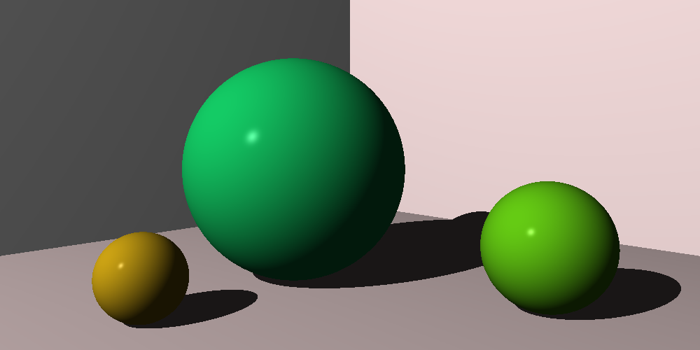

This ray tracer follows the book "The Ray Tracer Challenge" by Jamis Buck

This project is aimed at improving my low-level programming knowledge (and having fun).  Why Odin?  Quoting Odin's website, "Odin is the C alternative for the Joy of Programming."

